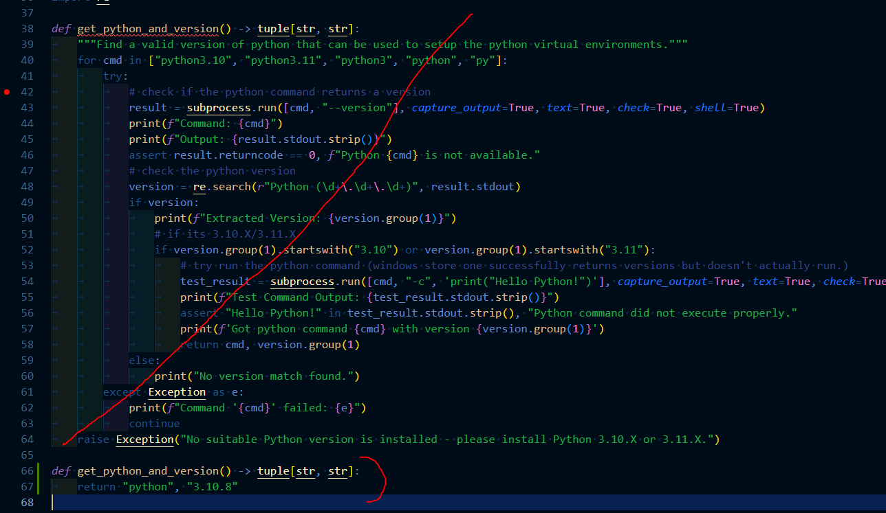

## Models And Nodes

- (PonyXL Checkpoint) https://civitai.com/models/376031/hassaku-xl-pony
- (PonyXL LORA) https://civitai.com/models/481529/dall-e-3-anime-style-pony

- (RemBG ComfyUI Node) https://github.com/john-mnz/ComfyUI-Inspyrenet-Rembg

## Using Custom ComfyUI

To use a custom instance of ComfyUI (for those that manually setup different version of ComfyUI with other support), simply run your custom comfyui instance, then run the proxy.py seperately using a command prompt or such.

You will need the following packages using pip as well: `tqdm requests fastapi pydantic pillow websocket-client aiohttp uvicorn websockets`

Finally, make sure to have the ComfyUI-Inspyrenet-Rembg custom node installed by john-mnz.

Steps:
1. Run ComfyUI
2. Go to ComfyUI-Manager
3. Custom Nodes Manager
4. Install the "ComfyUI-Inspyrenet-Rembg" node
5. Restart ComfyUI
6. Open a new terminal
7. Run `pip install tqdm requests fastapi pydantic pillow websocket-client aiohttp uvicorn websockets`
8. Run `python proxy.py` in the local-gen folder

## Troubleshoot

*You can check what python commands are working using the following individual commands:*
1. `py --version`
2. `python --version`
3. `python3 --version`
4. `python3.10 --version`

### Essentials
1. *DO NOT USE THE WINDOWS STORE PYTHON*
2. *DO NOT INSTALL PYTHON IN PROGRAM FILES / PROGRAM FILES (x86)*
3. *USE THE MOST UP-TO-DATE VERSION OF THE GAME*

### Terminal Errors:

### "'Python is not installed, installing now silently.' keeps failing over and over with 'curl not found'"
1. You can manually install python at https://www.python.org/downloads/release/python-3119/
2. OR Install curl manually then re-open the file.

#### "Exception No suitable Python version is installed..."
1. Uninstall any versions of python that are not Python 3.11.X or 3.10.X (use the commands above in a terminal)
2. Install Python 3.11.X on the webpage https://www.python.org/downloads/release/python-3119/ if either 3.11.X or 3.10.X is not already installed
3. Restart the one-click-comfyui file.

#### "Command failed with code XXXXXXXXXX ... venv/Scripts/python.exe ... --lowvram"
1. Close any running one-click-comfyui terminals
2. Delete the "venv" folder in "local-gen/tools/ComfyUI"
3. Restart the one-click-comfyui file.

#### "WARNING: Ignoring invalid distribution ~~p (PATH_TO_PYTHON\Lib\site-packages)"
1. Uninstall the version of python that is throwing this error
2. Reinstall the python version if you need it (use either 3.10.X or 3.11.X).
3. Restart the one-click-comfyui file.

#### "Error while deserializing header: MetadataIncompleteBuffer"
1. Head to "local-gen/tools/ComfyUI"
2. In the models/checkpoints, delete the hassakuXL model
3. In the models/loras, delete the dalle magik model
4. Restart the one-click-comfyui file and let it download the files again.

#### "Failed to activate virtual environment"
1. Close any running one-click-comfyui terminals
2. Delete the "venv" folder in "local-gen/tools/ComfyUI"
3. Restart the one-click-comfyui file.

#### "'Unable to connect to ComfyUI' even when the terminal says you should be able to"
1. Disable any adblocks OR whitelist the file.

#### "Torch not build with CUDA enabled"
1. When the prompt asks you if you have a NVIDIA gpu, enter YES
2. When the prompt asks you what version of cuda do you have, follow the instructions to find the version.
3. When the prompt asks if you have a older GPU, and you have a GPU older than the 1060, enter YES.
4. If the above steps do not work, delete the "venv" folder and repeat, otherwise join the discord and head to #local-image-gen-help.

#### "'Cuda Error' of any type"
1. If you are using an OLDER gpu than the 1060, make sure to put YES for the "older gpu" prompt when opening the one-click-comfyui.bat.
2. You may need to install or upgrade your CUDA toolkit found on the page https://developer.nvidia.com/cuda-downloads
3. Try uninstall and reinstall cuda.
4. If none of the above work, please join the discord and head to #local-image-gen-help.

## Forcing Specific Python Versions / Filepaths



You can replace the `def get_python_and_version() -> tuple[str, str]:`
function with the following in the `installer.py`:
```py
def get_python_and_version() -> tuple[str, str]:
	return "python", "3.11.9"
```

or if you want to specify a filepath (such as a custom conda environment)

```py
def get_python_and_version() -> tuple[str, str]:
	return "C:/Users/USERNAME/miniconda3/envs/python_3_11/Scripts/python.exe", "3.11.9"
```
