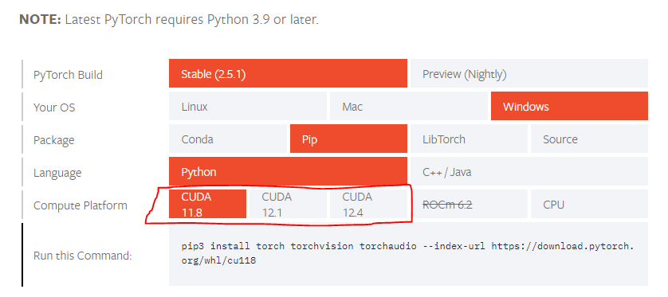

# Manual Installation and Running of ComfyUI/Proxy

Before proceeding, also check the LocalDOCS.md file if you already have a ComfyUI instance ready to go.
This guide is a COMPLETE installation from the ground up for ComfyUI AND the proxy.
The proxy part is also available in LocalDOCS.md

## Prerequisites for both ComfyUI and Proxy code

1. Install Python 3.11.9 with pip and venv (Windows comes preinstalled) https://www.python.org/downloads/release/python-3119/
2. Install git https://git-scm.com/downloads
3. Figure out which python command you're using by checking each `py --version`, `python --version`, `python3 --version` in a terminal to find the right version (3.11.9).

For any future instructions that uses the keyword "(python here)", replace with the `py`, `python` or `python3` depending on which you are using.

**This will not follow the installer.py format, so you will need to run this separately everytime you want to use it.**

## Windows ComfyUI

### For NVIDIA GPUs (portable standalone build)

Download the portable standalone 7zip file provided at https://github.com/comfyanonymous/ComfyUI?tab=readme-ov-file#windows . You may need to install 7zip to extract the file located at https://7-zip.org/download.html . In the extracted folder, simply run `run_nvidia_gpu.bat` for NVIDIA GPU or `run_cpu.bat` for CPU.

### For NVIDIA GPUs (complete setup):

1. git clone https://github.com/comfyanonymous/ComfyUI to any location you'd like.
2. Open a terminal IN THE DIRECTORY of COMFYUI and run `(python here) -m venv venv`
3. Run `venv/Scripts/activate` and your terminal now should start with "(venv)" on the far left.
4. Run `pip install -r requirements.txt`
5. Run `nvidia-smi` in the terminal to get your CUDA version (top right). If it does not appear, install nvidia drivers then close terminal and restart it again.
6. Visit https://pytorch.org/get-started/locally/ and select the following, then pick your CUDA version (compute platform).

7. Run `pip uninstall torch torchaudio torchvision`
8. Copy the command at the bottom, `pip3 install torch torchvision...`, and run it.
9. Head to the custom_nodes folder and open a terminal in there.
10. Run `git clone https://github.com/ltdrdata/ComfyUI-Manager`
11. Go back to the ComfyUI folder
9. Run `(python here) main.py --lowvram` and edit/put any command line arguments you'd like afterwards for ComfyUI.

**For CPU**, ignore steps 5-8 and simply do `pip install torch torchaudio torchvision` by itself, then proceed with step 9.

### For AMD GPUs:

Follow the instructions provided at https://github.com/patientx/ComfyUI-Zluda?tab=readme-ov-file#setup-windows-only for the normal installation.
Note this is a EDITED version of ComfyUI specifically for AMD.

### For INTEL GPUs

Follow the additional steps provided at https://github.com/comfyanonymous/ComfyUI?tab=readme-ov-file#intel-gpus and https://github.com/comfyanonymous/ComfyUI/discussions/476#discussion-5070898

## Linux ComfyUI

1. git clone https://github.com/comfyanonymous/ComfyUI to any location you'd like.
2. Open a terminal IN THE DIRECTORY of COMFYUI and run `(python here) -m venv venv`
3. Run `venv/bin/activate` and your terminal now should start with "(venv)" on the far left.
4. Run `pip install -r requirements.txt`
5. Visit https://pytorch.org/get-started/locally/ and PyTorch Build Stable, OS Linux, Package Pip, Language Python, and finally select the CUDA version you have for NVIDIA GPUs, ROCm for AMD GPUs, otherwise CPU for any other types..
6. Run `pip uninstall torch torchaudio torchvision`
7. Copy the command at the bottom of the start locally pytorch page, `pip3 install torch torchvision...`, and run it.
8. Head to the custom_nodes folder and open a terminal in there.
9. Run `git clone https://github.com/ltdrdata/ComfyUI-Manager`
10. Go back to the ComfyUI folder
11. Run `(python here) main.py --lowvram` and edit/put any command line arguments you'd like afterwards for ComfyUI.

## Mac ComfyUI

Follow the instructions provided at https://github.com/comfyanonymous/ComfyUI?tab=readme-ov-file#apple-mac-silicon

## Running the Abyss Diver Proxy separately for Windows/Linux/Mac

This allows the game to connect to ComfyUI running on http://127.0.0.1:8188. If you're running a custom comfyui instance, you can run this by itself then separately run your instance. If you need to change the IP, edit the `proxy.py` file.

1. Run `pip install tqdm requests fastapi pydantic pillow websocket-client aiohttp uvicorn websockets` in any terminal.
2. Run `(python here) proxy.py` in the local-gen folder to start the proxy.
3. The game now can connect to the proxy, which the proxy connects to a running ComfyUI instance.
